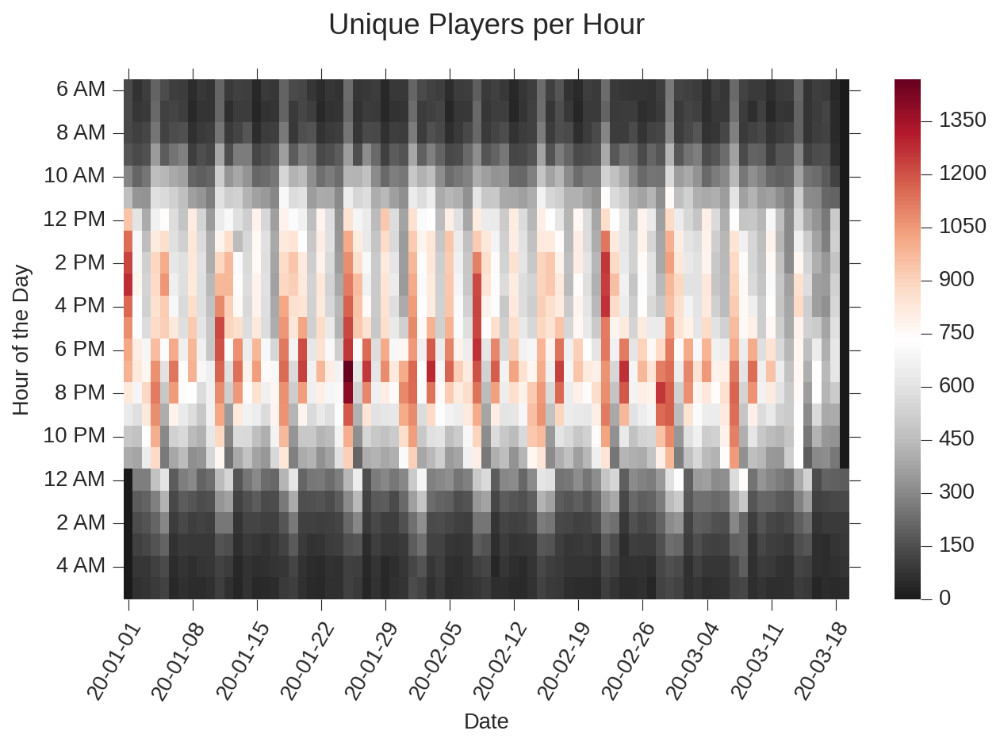

    <title>COVID19 Social Distancing Analysis</title>
    <meta name="description" property="og:description" content="Analytics procedure that measures the impact of social distancing on Casino Play.">
    <meta name="image" property="og:image" content="../images/covidanalysis_screenshot.png">
    <meta name="author" content="Miguel Niblock">
    <meta name="title" property="og:title" content="COVID19 Social Distancing Analysis">

# COVID19 Social Distancing Analysis

Analytics procedure that measures the impact of social distancing on Casino Play.

> <u>Note:</u> This project's source code is proprietary. The current page is a high-level description for informational purposes. A sample of the source code can be requested to Gaming Analytics, Inc. Please contact me for details.

## Context

Starting April of 2020, quarantine measures forced casinos to close. As an analytics service for casinos, Gaming Analytics wanted to provide its customers a better understanding of how exactly were social distancing measures impacting the ways people ordinarily play in their casinos. This would also be useful as an estimation of business metrics at the time of eventual reopening. 

The part that made this project challenging is that there's no standard procedure for answering this question. While a standard data analysis report could be made from observed metrics, this wouldn't tell us how their downward evolution resulted as a consequence of social distancing. So the primary question became, **"How to objectively define the effects of social distancing, as a function of the data?"** We knew that there was less money coming in, as the data showed less and less revenue in the weeks leading to April. But was that a consequence of social distancing? Or was it a consequence of less players? Smaller bets? 

### Solution

We reasoned that if social distancing had any effects on casino play, it would consist of less people playing in adjacent machines at the same time. Thus the first step would be to develop an algorithm that applied to each machine, can tell us which other machines can be considered adjacent. The next step would be to count the number of sessions that occurred simultaneously between every pair of adjacent machines. After much experimentation, a functioning Jupyter Notebook prototype came about, which could implement all this logic on very large datasets.

The rest of the process consisted on fine-tunning certain parts of the procedure to optimize for runtime, and other class definitions. For example, we might define a neighboring concurrent session as an instance in which two sessions had a concurrency time of more than 1 minute and took place in two machines considered neighbors.

Ultimately, this procedure counted the number of neighboring concurrent sessions per day, and served as supporting evidence that the decrease in revenue came as a product of less people playing next to each other. With this information at hand, it became easier to produce plots that put this data into better perspective by combining it with other metrics. A sample of visualizations are provided below:

> These visualizations are not the main source code. They're simply an Exploratory Data Analysis of the data produced by the main procedure described above. The insights provided by these plots is anonymous.

<iframe class="jupyter" src="covid19analysis_plots-styled.html" width="100%" height="400" style="border:1px solid black;">
            </iframe>