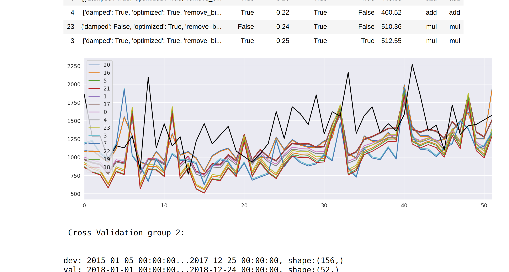
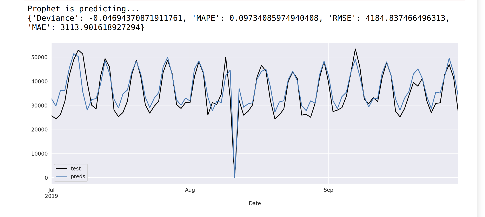

    <title>DSEnsemble | Forecasting Algorithm</title>
    <meta name="description" property="og:description" content="DSEnsemble is a forecasting algorithm for day series data with seasonality.">
    <meta name="image" property="og:image" content="">
    <meta name="author" content="Miguel Niblock">
    <meta name="title" property="og:title" content="">

# DSEnsemble

Ensemble algorithm for forecasting day series data with seasonality.

> <u>Note:</u> This project's source code is proprietary. The current page is a high-level description for informational purposes. A sample of the source code can be requested to Gaming Analytics, Inc. Please contact me for details.

## Context

During my time as an intern at Gaming Analytics, one of the obstacles faced by the team was the sometimes unimpressive accuracy of the forecasting model in production. Apparently it had been developed by a previous employee whose approach was one-of-a-kind and cryptic, and thus too time-consuming trying to patch. So my task was to develop a forecasting module from scratch, that could improve accuracy and be more maintainable.

After much experimentation and input from colleagues and superiors, I arrived at a novel, yet relatable approach that combined two great algorithms: Holt Winters, and Facebook's Prophet. Here's how I got there...

## Requirements

The primary challenge in developing this forecasting model was the small datasets available for some of the customers. A requirement was that the model must be applied to the data of all the customers, some of which only have 1-2 years of data saved. 1-2 years sounds like a lot of data, but it's not for the purposes of predicting daily estimates. That's because each year contains a full range of seasonal variations that must be analyzed by the algorithm in order to predict a whole 365 days into the future. Otherwise we only have the weekly seasonal variations, which say that weekends have more revenue than weekdays.

Another requirement is that the model must have good accuracy when predicting a whole year into the future. That's because it would be used for estimating next year's revenue. Therefore it was imperative to capture the yearly seasonal variation. To put things into perspective, weather forecasts usually predict no more than 10 days in advance. And most of the readily-available open source software for forecasting aren't meant to encompass seasonal components. One exception of this, is Prophet.

## Prophet

Prophet is an open source library for forecasting day-series data with seasonality, created by Facebook employees. My boss loved Prophet so much because it's really easy to use. It's so easy to use, my boss would've loved to do the job without my help. (Pun!) Unfortunately Prophet falls short if you expect very granular results. Prophet's prediction output simply lacks detail. It looks like nice round sine waves, no matter how much you configure it to be more precise. To condense Prophet's algorithm into a simple sentence, that's because it is actually built by combining a bunch of seasonal components as oscillators.

Luckily Prophet has a feature that allows you to put "additional regressors" into the equation, whose values get incorporated into the final forecast. This would allow another algorithm's output to add detail to the otherwise unrealistic output of Prophet. 

## Forecasting Ensembles

In the meantime, after many unpromising experiments with single instances of various algorithms, we stumbled onto the idea of an ensemble of weak forecasting learners. This approach is common in other areas of machine learning such as non-sequential regression and classification. After much research on the topic, it seemed nothing of the sort is remotely available as an open source library. And although I found that it's been a prevailing topic of interest in the data science community, no instances were available as concrete proof of concept. 

Nevertheless, by studying in depth how RandomForestRegressor works, I quickly came up with a prototype that could use any desired time-series algorithm. The Holt Winters algorithm quickly became our favorite. As I found workarounds to the issues of the small datasets, and many other sticky, hyper-complex technical details, this became a huge multi-tiered algorithm that could operate with no errors and good results.

## Holt Winters Ensemble

The Holt Winters ensemble works by creating an instance of the algorithm for each possible combination of categorical parameters available in the implementation from statsmodels. Each of these initial instances (parameter-combos) would receive automatic values for their continuous parameters, as provided by statsmodels, to simplify things in the first stage. The algorithm first ranks these instances by their accuracy, then discards instances with very bad results or errors, and then it refines the continuous parameters of the remaining instances via binary search. It lastly aggregates the instance outputs via various methods that depend on the data like exponentially-weighted-moving-averages. It also uses an anomaly detector (which I also developed) to flatten out anomalies at various points of the procedure. To close off, the output of this ensemble is then be added to Prophet as an "additional regressor", and Prophet is allowed to do its thing as usual. 

The accuracy scores obtained with this procedure were bombastic. The procedure outperformed vanilla-Prophet by far, and also the previous model in production. One downside was the potentially long runtime, which was primarily caused by the binary search for the adequate continuous parameters. Fortunately, modifications can be implemented in this area without interfering with the overall algorithm. 

The above screenshot of the output is a testament to its accuracy. As is indicated there, the output is coming from Prophet, but it does not exhibit the nice n' round shapes from its vanilla state. The output has much more contrast and closely resembles the test data in this problem.