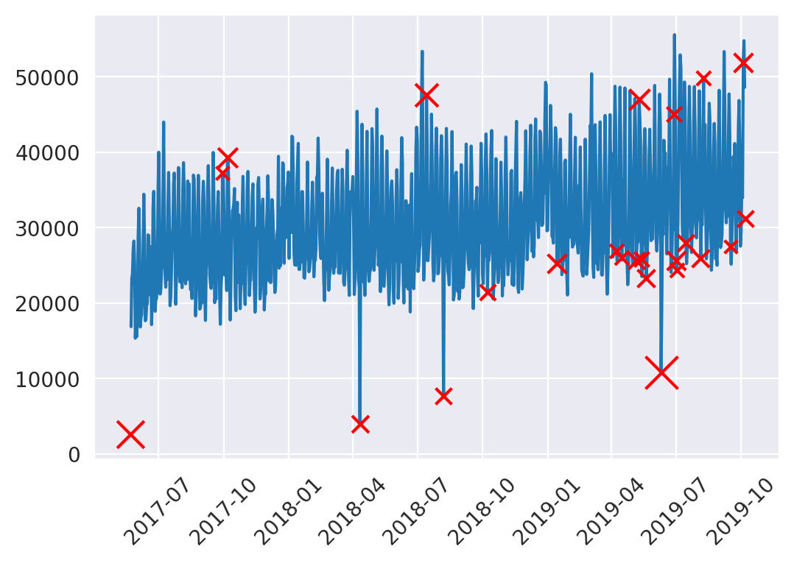

    <title>Luminol DS Detector</title>
    <meta name="description" property="og:description" content="A Python module for anomaly detection on day series with seasonality.">
    <meta name="image" property="og:image" content="../images/luminoldsdetector_screenshot.png">
    <meta name="author" content="Miguel Niblock">
    <meta name="title" property="og:title" content="Luminol Day-Series Detector">

# Luminol DS Detector

A Python module for anomaly detection on day series with seasonality.

> <u>Note:</u> This project's source code is proprietary. The current page is a high-level description for informational purposes. A sample of the source code can be requested to Gaming Analytics, Inc. Please contact me for details.

## Context

This was my first project as an intern at Gaming Analytics. The product at the time utilized some hard-coded statistical functions to flag anomalies in the metrics used, and my task was to produce a more sophisticated and accurate system for anomaly detection. The accuracy of an anomaly detector can only be objectively assessed in the presence of labeled data, i.e., data that shows examples of what should and shouldn't be considered an anomaly. Since that was not the case here, my goal was to produce a model whose results would satisfy the heuristic notion of an anomaly. In other words, when visualized, its results should make visual sense as much as possible. 

### Research

The next step was to delve into the extensive literature and existing code for anomaly detection systems. Although many kinds of anomaly detection algorithms exist, very few of them are suitable for use in time-series data. That's because the most ordinary machine learning algorithms taught in data science bootcamps are of the kind that assume Independent and Identically Distributed random samples. Examples of these algos include: Random Forest, Support Vector Machines, K Nearest Neighbors, One Class SVM, and Local Outlier Factor, etc. This assumption of IID means that these algorithms imagine the data to be a random sample of observations from any point in time. They can't deal with the fact that normality on a Friday might seem as anomalous on a Tuesday. Or that normal levels in December might seem anomalous for March.

One sensible way to perform anomaly detection in time series data is with the aid of a forecasting model. If you know the forecast is proven to have a good accuracy, and an actual observation differs too much from the forecast value, then it's an anomaly. The only issue with this approach was that their forecasting algorithms in production were sucky at the time. (That would turn out to be my next project) And my boss didn't quite agree with this solution, he wanted me to build an anomaly detection model, not a forecasting model. So for now I had to keep looking for unconventional algorithms for anomaly detection that are time-aware.

I also became aware of the novel use of models based on neural-networks, for anomaly detection on time-series; For example, LSTMs and Auto Encoders. These methods have the advantage to be able to identify anomalies in multivariate time series data. However, our use for this detector was limited to univariate anomalies, so these solutions seemed overkill. Also we were reluctant to employ such complex solutions at first.

### Conclusion

After experimenting with various algorithms I considered appropriate, our brand new tool started to take shape. For specific details, please message me privately.

This notebook is a basic demo of the resulting module in practice. Here we get some data, import the module, explain some of the arguments, and show the output.

<iframe class="jupyter" src="LuminolDS_testing-styled.html" width="100%" height="400" style="border:1px solid black;">
            </iframe>

The heading "Init Params" contains the parameters we may pass to the class instance. The value after the "=" is the default value for the parameter, if not specified.

- By using `get_lastday_only = False`, we can get anomaly scores for every value in the series.
- `get_lastday_only` might be useful if you're running this module every day to get the next score or label.
- `get_labels_only = False` will give us the anomaly scores only, and not the labels. Getting the labels would be useful if you only want to know whether a day had an anomalous value or not. {0,1}. Getting the scores is more useful because you can further process the data, for example, to produce a plot. 
- `score_threshold` is the value above which an anomaly score is considered an anomaly. This is only relevant if you are getting labels as output because higher thresholds will produce fewer anomalies (more 0's than 1's), and lower thresholds will produce more anomalies (more 1's than 0's).

### Real World Use

As an example of how useful this module can be in a real world application, let us consider the following notebook. These cells were extracted as a section from another module, which requires outlier removal as part of its internal functionality. 

In this example, we pass our DataFrame "ts_inter" (time-series interpolated) through the module. We then set the anomaly score threshold to 3 and identify our anomalies. We then configure a plot by generating scaled values based on the severity of each anomaly, to later use as visual indicators in the plot. After confirming that our plot satisfactorily flags anomalies, we remove them by their index position.

<iframe class="jupyter" src="Drop_outliers-styled.html" width="100%" height="400" style="border:1px solid black;">
            </iframe>