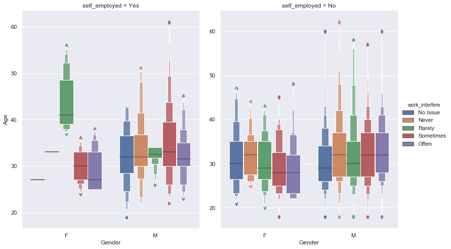

    <title>Research Proposal- Mental Health in Technology</title>
    <meta name="description" property="og:description" content="Exploratory data analysis and experimentation plan to find out if certain working conditions can reduce the loss in productivity caused by mental health issues.">
    <meta name="image" property="og:image" content="../images/mentalhealthtech_screenshot.png">
    <meta name="author" content="Miguel Niblock">
    <meta name="title" property="og:title" content="Research Proposal- Mental Health in Technology">

# Research Proposal- Mental Health in Technology

Exploratory data analysis and experimentation plan to find out if certain working conditions can reduce the loss in productivity caused by mental health issues. 

## Summary

- See the report as static Jupyter Notebook [here](https://miguelniblock.github.io/Research-Proposal_Mental-Health-in-Tech/Deliverables/index.html).
    - Or get it in [PDF](https://miguelniblock.github.io/Research-Proposal_Mental-Health-in-Tech/Deliverables/PDF.Research-Proposal_Mental-Health-in-Tech.pdf).
- Code repository [home](https://github.com/MiguelNiblock/Research-Proposal_Mental-Health-in-Tech).

