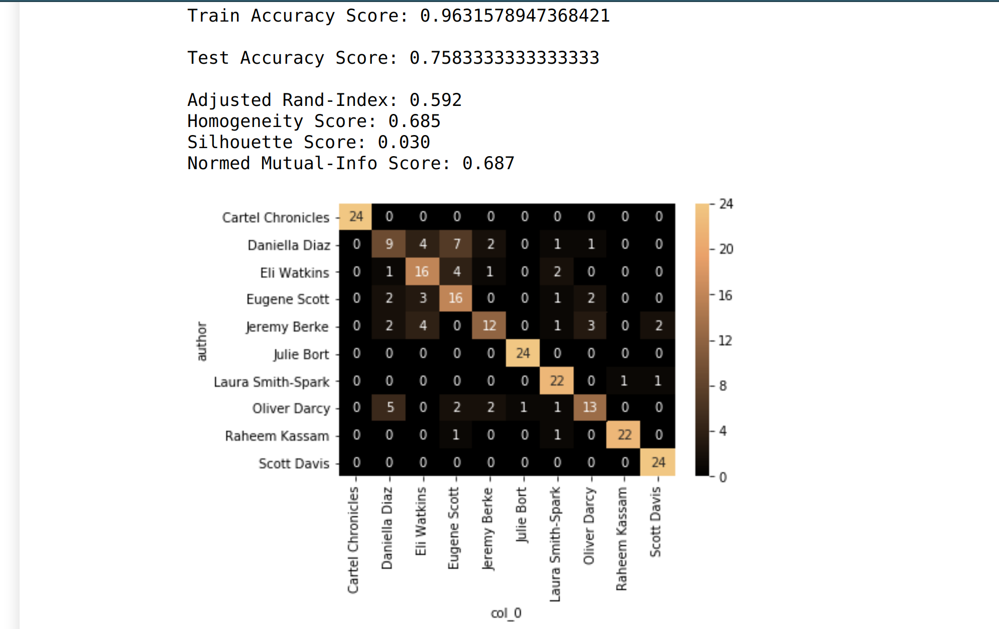

    <title>NLP- Predict the Author</title>
    <meta name="description" property="og:description" content="This procedure compares various techniques used in NLP such as Latent Semantic Analysis, Bag of Words and TFIDF; to predict the author for a given article.">
    <meta name="image" property="og:image" content="../images/predictauthor_screenshot.png">
    <meta name="author" content="Miguel Niblock">
    <meta name="title" property="og:title" content="NLP- Predict the Author">

# NLP- Predict the Author

This procedure compares various techniques used in NLP such as Latent Semantic Analysis, Bag of Words and TFIDF; to predict the author for a given article.

## Summary

- **[Notebook](https://miguelniblock.github.io/Natural-Language-Processing_Predict-the-Author/docs/index.html) with procedure-** This single-notebook Python procedure has its own TOC and includes headings like "Introduction to Dataset", "Exploratory Data Analysis", "Supervised Feature Generation", "Unsupervised Feature Generation", and "Choosing  Model".
    - Also as [PDF](https://miguelniblock.github.io/Natural-Language-Processing_Predict-the-Author/Deliverables/NLP-Predict_the_Author.pdf).
- Code repository [home](https://github.com/MiguelNiblock/Natural-Language-Processing_Predict-the-Author).

## Context

NLP techniques like **Bag-of-Words** and **Latent Semantic Analysis** can be useful to turn a raw pool of text into a tabular format that standard machine learning algorithms can understand. 

If we take a given text as training data, and take a group of author names as prediction target, we can build a supervised classification model that learns to identify an author's style of writing. 

The table below shows the final results of my project. From top to bottom, are the best-performing algorithms as well as an indicator for which technique was used for feature-engineering: **BOW**(*Bag-of-Words*) VS **LSA**(*Latent Semantic Analysis*)	

<iframe class="jupyter" src="NLP-Predict_the_Author-styled.html" width="100%" height="400" style="border:1px solid black;">
            </iframe>