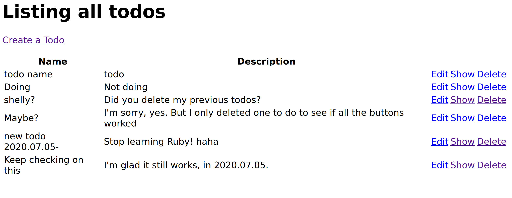

    <title>To Do App</title>
    <meta name="description" property="og:description" content="MVC (Model View Controller) app deployed on Heroku, that uses a postgreSQL database for storing todos. To-dos are persistent, so you may visit the [live page](https://miguel-todo-app.herokuapp.com/todos) and add/edit/delete some if you wish!.">
    <meta name="image" property="og:image" content="../images/todoruby_screenshot.png">
    <meta name="author" content="Miguel Niblock">
    <meta name="title" property="og:title" content="To Do App">
# To Do App

MVC (Model View Controller) app deployed on Heroku, that uses a postgreSQL database for storing todos. To-dos are persistent, so you may visit the [live page](https://miguel-todo-app.herokuapp.com/todos) and add/edit/delete some if you wish!.

## Summary

- **Live app URL-** https://miguel-todo-app.herokuapp.com/todos
- **Code repository-** [https://github.com/MiguelNiblock/ruby_todo_app](https://github.com/MiguelNiblock/ruby_todo_app)
