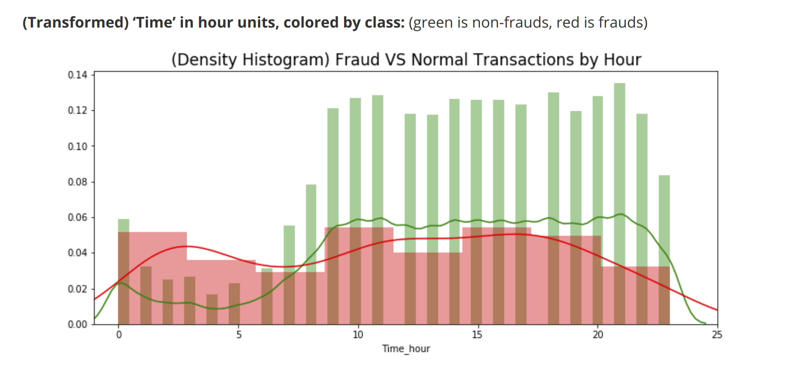

    <title>Supervised Learning- Credit Card Fraud</title>
    <meta name="description" property="og:description" content="Machine learning model that classifies fraudulent transactions in a dataset with class imbalance.">
    <meta name="image" property="og:image" content="../images/creditfraud_screenshot2">
    <meta name="author" content="Miguel Niblock">
    <meta name="title" property="og:title" content="Supervised Learning- Credit Card Fraud">

# Supervised Learning- Credit Card Fraud

Machine learning model that classifies fraudulent transactions in a dataset with class imbalance.

## Summary

- **Presentation slides as [PDF](https://miguelniblock.github.io/Supervised-Learning_Credit-Card-Fraud/Slides_Presentation/Slides.Supervised-Learning_Credit-Card-Fraud.pdf)-** Provides an overview for the project raison d'etre, as well as a summary of techniques employed and findings.
- **Project [notebook](https://miguelniblock.github.io/Supervised-Learning_Credit-Card-Fraud/docs/index.html)-** This project is contained in a single notebook with a TOC. Includes headings for Exploratory Data Visualizations, Feature Engineering/ Modeling, Processing, Optimization and algorithm comparison. 
    - Available in [PDF](https://miguelniblock.github.io/Supervised-Learning_Credit-Card-Fraud/Deliverables/Full.Supervised_Learning-Credit_Card_Fraud.pdf)
- **Repository [home](https://github.com/MiguelNiblock/Supervised-Learning_Credit-Card-Fraud/)-** All the project assets.

## Context

This goal of this project is to build a model best identifies transactions labeled fraudulent. The data available represents credit card transactions labeled as either fraudulent or non fraudulent. Since fraud is rare, the number of non-fraudulent examples greatly out-numbers the fraudulent ones. This poses a challenge to the model because it must learn to recognize the characteristics of a fraudulent transaction despite the class imbalance. To this end, techniques to deal with class imbalance are employed. They involve things like, SMOTE (Synthetic Minority Oversampling Technique), Feature Selection and Engineering based on correlation, and outlier removal.

In order to select the final model, we compare the f1 scores of various results. F1 score optimizes for both high Recall and Precision. Some models might correctly identify all the fraudulent items, while simultaneously labeling every other item as fraudulent also. Even though high Recall is desirable, it is not desirable at the expense of Precision. F1 strikes a good balance between these two important error metrics.