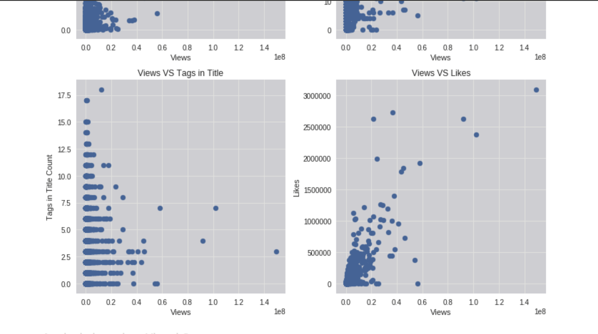

    <title>Analytic Report- Youtube Trending Videos</title>
    <meta name="description" property="og:description" content="Short and sweet analytic report on a dataset that contains Youtube's trending videos from 2017-18. I set out to produce some visually pleasing plots and answer some analytical questions using T-Tests, to make the most out of the data.">
    <meta name="image" property="og:image" content="../images/youtubereport_screenshot.png">
    <meta name="author" content="Miguel Niblock">
    <meta name="title" property="og:title" content="Analytic Report- Youtube Trending Videos">

# Analytic Report- Youtube Trending Videos

Short and sweet analytic report on a dataset that contains Youtube's trending videos from 2017-18. I set out to produce some visually pleasing plots and answer some analytical questions using T-Tests, to make the most out of the data.

## Summary

- See a static render of the [notebook](https://miguelniblock.github.io/Analytic-Report_Youtube-Trending-Videos/Deliverables/index.html), 
    - or in [PDF](https://miguelniblock.github.io/Analytic-Report_Youtube-Trending-Videos/Deliverables/Analytic-Report_Youtube-Trending-Videos.pdf).
- Code repository [home](https://github.com/MiguelNiblock/Analytic-Report_Youtube-Trending-Videos).